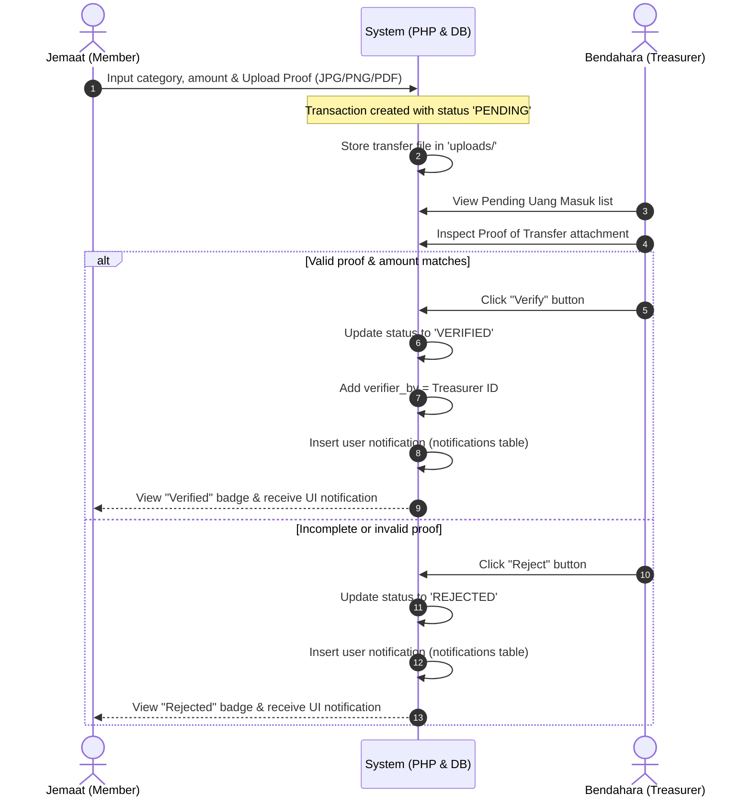
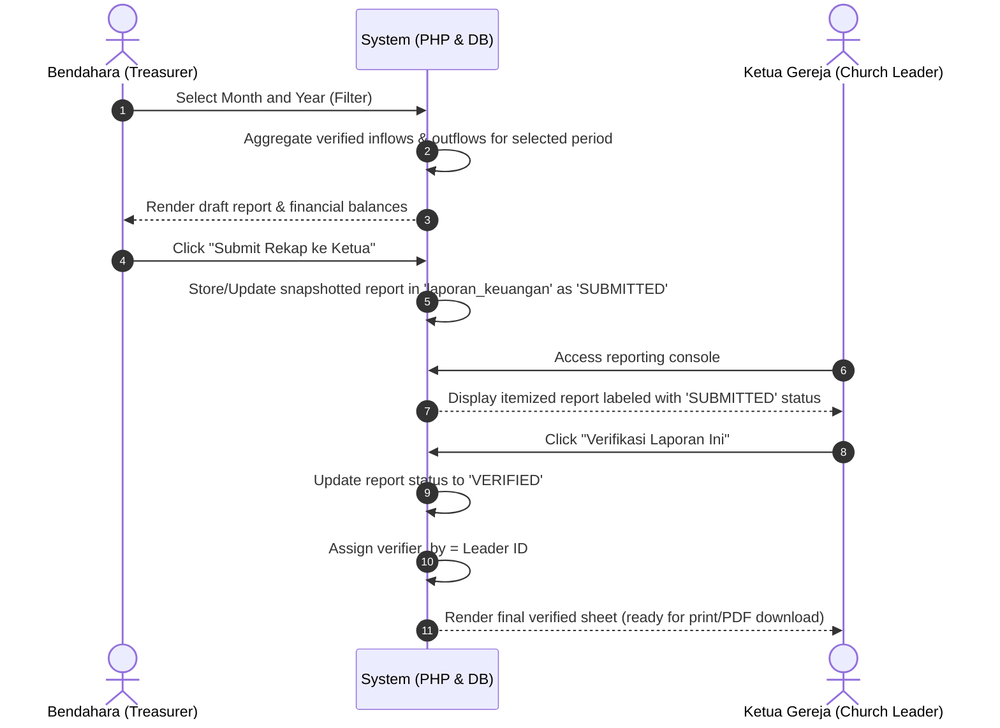

# Church Management System (SIGereja) Workflow Analysis

This document provides a comprehensive structural and behavioral analysis of the church management system. The application coordinates administrative, demographic, and financial workflows between church leaders, administrators, and congregation members.

---

## 1. System Role Architecture & Permissions Matrix

The system governs actions using four distinct user roles, defined in the `users` table:

| Page / Feature | JEMAAT (Member) | SEKRETARIS (Secretary) | BENDAHARA (Treasurer) | KETUA_GEREJA (Church Leader) |
| :--- | :---: | :---: | :---: | :---: |
| **Personal Profile Management** (`profil_saya.php`) | **Write / Update** | No Access | No Access | No Access |
| **Congregation Directory** (`data_jemaat.php`) | No Access | **Read Only** | **Read Only** | **Read Only** |
| **Submit Contribution Proof** (`setoran_saya.php`) | **Write / Upload** | No Access | No Access | No Access |
| **Inflow Verification & Manual Input** (`uang_masuk.php`) | No Access | **Read Only** | **Write / Verify / Reject** | **Read Only** |
| **Outflow Registration** (`uang_keluar.php`) | No Access | **Read Only** | **Write / Record** | **Read Only** |
| **Financial Reporting** (`laporan.php`) | No Access | No Access | **Write (Submit Recap)** | **Write (Verify / Sign Off)** |
| **Audit Logs & Activity Logging** | Automatic | Automatic | Automatic | Automatic |

---

## 2. Dynamic Workflow Visualizations

### A. Congregation Contribution & Approval Workflow

---

### B. Monthly Financial Reporting & Sign-Off Workflow

---

## 3. In-Depth Operational Workflows

### 3.1 Congregation (Jemaat) Member Lifecycle
1. **Account Credentials & Profiling**:
   - The user registers and logs in as `JEMAAT`.
   - On `profil_saya.php`, they submit demographic (place/date of birth, address, occupation, blood group) and ecclesiastical (baptism status/date, Sidi/confirmation status/date, marriage details) information.
   - Upon first submission, the system automatically allocates a unique member identification code (`no_anggota`) with the format: `JMT-{YEAR}{USER_ID_PADDED}` (e.g., `JMT-20260004`).
2. **Transfer of Offerings/Tiths**:
   - Members input contributions (offerings, building funds, tithes, social diaconia) through a file-upload form that strictly validates and sanitizes file types (`jpg`, `jpeg`, `png`, `pdf`).
   - The member's transaction history automatically tracks approval statuses with colored, readable status badges.

### 3.2 Financial Management (Bendahara) Actions
1. **Verification of Inflows**:
   - Checks the transaction log. Reviews receipts, verifying bank transfers match the declared amount.
   - Rejects or confirms with single-click actions. An automatic database trigger logs the action and feeds the notification table.
2. **Anonymous Inflow Entries**:
   - When cash collections (Kolekte) or walk-in donations are received, the Treasurer logs these manually. They are automatically marked `VERIFIED` and bypass the upload phase.
3. **Outflow (Expense) Management**:
   - Under `uang_keluar.php`, the Treasurer registers any disbursement. They choose a high-level cost classification (`Biaya_Pembangunan`, `Biaya_Sosial`, `Biaya_Khusus`, `Biaya_Umum`) and tag it with a specific line item descriptor (e.g., "Electricity", "Sanctuary Paint").
4. **Draft Reporting & Closing**:
   - Performs a monthly wrap-up, compiling summaries of income vs. expenditure to establish the closing period balance. Submits the sheet to the Leader for formal sign-off.

### 3.3 Oversight & Review (Ketua Gereja) Actions
1. **Real-time Balance Dashboard**:
   - Reviews the primary church liquidity position: `Global Saldo = Total Verified Inflows - Total Registered Outflows`.
2. **Ecclesiastical Financial Sign-off**:
   - Audits the Treasurer's monthly statements against itemized logs.
   - Seals the ledger by verifying the submitted record, marking the period as closed and verified.
   - Generates hard copies or PDF exports via custom media print stylesheets.

---

## 4. Key Database Integrity & Log Mechanics

- **Referential Integrity**:
  - `jemaat_profiles.user_id` cascades on user deletion.
  - Financial records (`uang_masuk.user_id` and `verified_by`) set to `NULL` on user deletion to preserve historical balancing and accounting entries.
- **Activity Logger (`logger.php`)**:
  - The application logs every operational transition (e.g., `LOGIN_SUCCESS`, `MANUAL_TX_INPUT`, `TX_VERIFICATION`, `LAPORAN_SUBMIT`, `UPDATE_PROFILE`) into a structured text file (`logs/system_activity.log`) alongside timestamped IPs and session identity IDs to establish robust audit trails.
